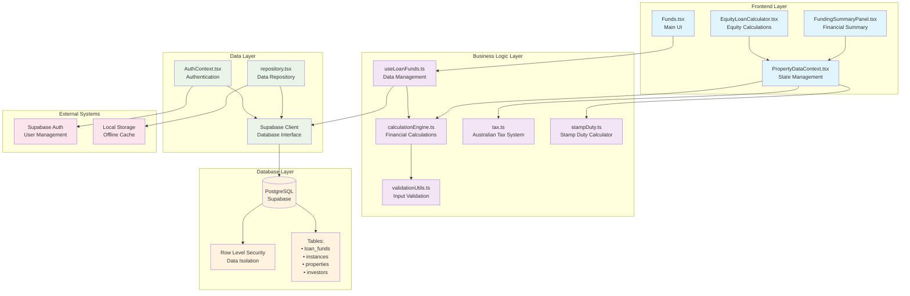
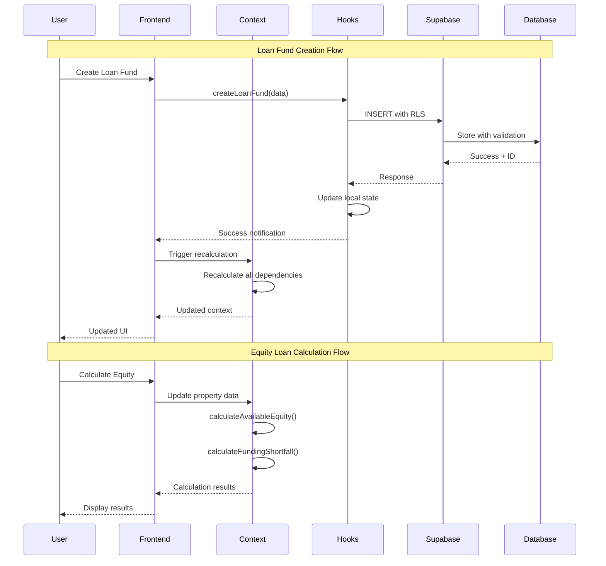
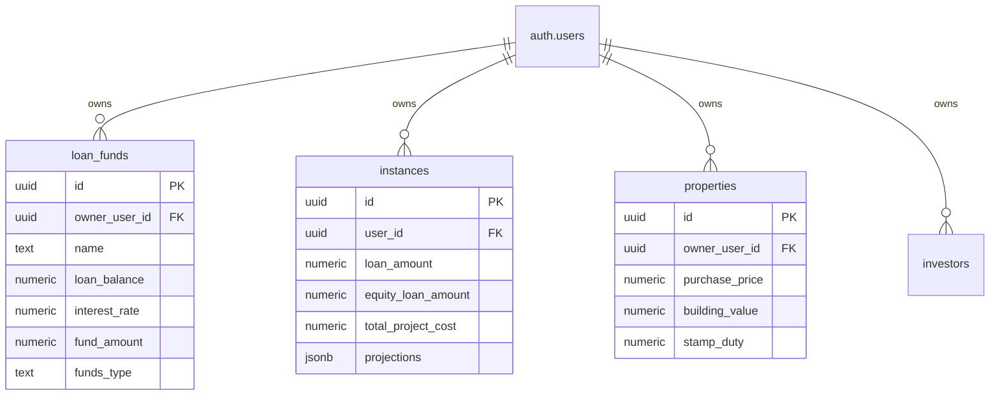
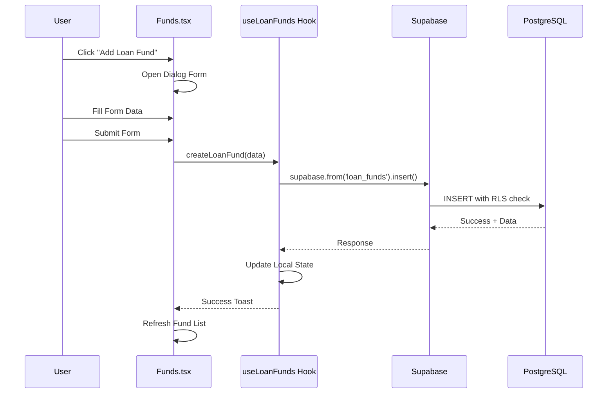
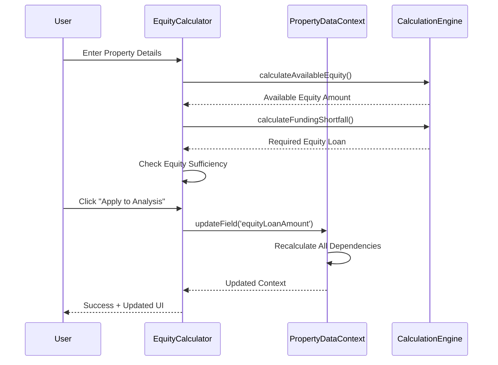

# Property Investment Analysis (PIA) - Funds System Deep Analysis

## Executive Summary

This comprehensive analysis examines the funds system in the Property Investment Analysis (PIA) application, a React-based property investment calculator built with Supabase backend. The system manages loan funds, property financing, equity calculations, and investment projections for Australian property investments.

**Key Finding**: The application implements a sophisticated financial calculation engine but has **significant security vulnerabilities** and **missing transaction management** that require immediate attention.

---

## 1. System Architecture Overview

### 1.0 System Architecture Diagram



### 1.1 Data Flow Architecture



---

## 1. System Architecture Overview

### 1.1 Technology Stack

- **Frontend**: React 18 + TypeScript + Vite
- **Backend**: Supabase (PostgreSQL + Auth + RLS)
- **UI Framework**: Tailwind CSS + shadcn/ui
- **State Management**: React Context API
- **Database**: PostgreSQL with Row Level Security (RLS)

### 1.2 Core Components

```
src/
├── pages/Funds.tsx                    # Main funds management UI
├── hooks/useLoanFunds.ts             # Loan funds data management
├── components/FundingSummaryPanel.tsx # Financial summary display
├── components/EquityLoanCalculator.tsx # Equity loan calculations
├── contexts/PropertyDataContext.tsx   # Central state management
├── utils/calculationEngine.ts        # Financial calculations
├── utils/calculationUtils.ts         # Calculation utilities
├── utils/tax.ts                      # Australian tax calculations
├── utils/stampDuty.ts                # Stamp duty calculations
└── integrations/supabase/            # Database integration
```

---

## 2. Funds Data Models & Database Schema

### 2.1 Primary Funds Table: `loan_funds`

**Location**: `supabase/migrations/20250809050001_add_loan_funds_table.sql:5-30`

```sql
CREATE TABLE public.loan_funds (
  id UUID PRIMARY KEY DEFAULT gen_random_uuid(),
  owner_user_id UUID NOT NULL REFERENCES auth.users(id) ON DELETE CASCADE,
  name TEXT NOT NULL,

  -- Construction Details
  construction_period INTEGER NOT NULL DEFAULT 9,
  construction_interest_rate NUMERIC NOT NULL DEFAULT 7.5,
  progress_payment_weeks INTEGER NOT NULL DEFAULT 4,
  progress_payment_percentage NUMERIC NOT NULL DEFAULT 5,
  progress_payment_description TEXT NOT NULL DEFAULT '4 Weeks - 5% of construction price',

  -- Financing
  loan_balance NUMERIC NOT NULL DEFAULT 0,
  interest_rate NUMERIC NOT NULL DEFAULT 0,
  loan_term INTEGER NOT NULL DEFAULT 30,
  loan_type TEXT NOT NULL DEFAULT 'IO,P&I',
  io_term INTEGER NOT NULL DEFAULT 5,
  loan_purpose TEXT NOT NULL DEFAULT 'Investment Mortgage',
  funds_type TEXT NOT NULL DEFAULT 'Savings',
  fund_amount NUMERIC NOT NULL DEFAULT 0,
  fund_return NUMERIC NOT NULL DEFAULT 0,

  created_at TIMESTAMPTZ NOT NULL DEFAULT now(),
  updated_at TIMESTAMPTZ NOT NULL DEFAULT now()
);
```

### 2.2 Related Financial Tables

#### `instances` Table (Main Investment Records)

**Location**: `supabase/migrations/20250821032947_create_instances_table.sql:4-100`

Key financial fields:

- `loan_amount`, `interest_rate`, `loan_term`
- `equity_loan_amount`, `equity_loan_interest_rate`
- `deposit_amount`, `funding_shortfall`, `funding_surplus`
- `total_project_cost`, `total_holding_costs`

#### `properties` Table (Property Assets)

**Location**: `supabase/migrations/20250809050000_fresh_schema_for_frontend.sql:89-143`

Key financial fields:

- `purchase_price`, `building_value`, `land_value`
- `stamp_duty`, `legal_fees`, `inspection_fees`
- `council_rates`, `insurance`, `maintenance_repairs`

### 2.3 Data Relationships



---

## 3. User Actions & Capabilities

### 3.1 Loan Funds Management

**Location**: `src/pages/Funds.tsx:14-574`

#### Create Loan Fund

- **Function**: `createLoanFund()` in `src/hooks/useLoanFunds.ts:105-141`
- **UI**: Lines 300-543 in Funds.tsx
- **Validation**: Client-side only (no server-side validation)
- **Data Flow**: Form → Hook → Supabase → UI Update

#### Update Loan Fund

- **Function**: `updateLoanFund()` in `src/hooks/useLoanFunds.ts:143-183`
- **UI**: Lines 81-99 in Funds.tsx (Edit dialog)
- **Security**: RLS policy ensures user can only update own funds

#### Delete Loan Fund

- **Function**: `deleteLoanFund()` in `src/hooks/useLoanFunds.ts:185-204`
- **UI**: Lines 118-128 in Funds.tsx
- **Confirmation**: Basic browser confirm() dialog

### 3.2 Equity Loan Calculations

**Location**: `src/components/EquityLoanCalculator.tsx:18-264`

#### Calculate Available Equity

```typescript
// Lines 31-33
const maxDebtAllowed = (primaryPropertyValue * maxLVR) / 100;
const availableEquity = Math.max(0, maxDebtAllowed - existingDebt);
```

#### Apply Equity Loan

- **Function**: `applyEquityLoan()` in lines 68-79
- **Integration**: Updates PropertyDataContext with calculated values
- **Validation**: Checks equity sufficiency before allowing application

### 3.3 Funding Analysis

**Location**: `src/contexts/PropertyDataContext.tsx:478-518`

#### Calculate Total Project Cost

```typescript
// Lines 309-316
const calculateTotalProjectCost = () => {
  const purchaseCosts =
    propertyData.stampDuty +
    propertyData.legalFees +
    propertyData.inspectionFees;
  const constructionCosts =
    propertyData.councilFees +
    propertyData.architectFees +
    propertyData.siteCosts;
  const baseCost = propertyData.isConstructionProject
    ? propertyData.landValue + propertyData.constructionValue
    : propertyData.purchasePrice;
  return (
    baseCost +
    purchaseCosts +
    constructionCosts +
    propertyData.totalHoldingCosts
  );
};
```

---

## 4. Financial Calculations Engine

### 4.1 Core Calculation Engine

**Location**: `src/utils/calculationEngine.ts`

#### Loan Payment Calculations

```typescript
// Lines 41-74
export const calculateLoanPayments = (
  principal: number,
  annualRate: number,
  termYears: number,
  ioTermYears: number = 0,
  currentYear: number = 1,
  frequency: 'weekly' | 'monthly' = 'monthly'
): { interestOnlyPayment: number; principalAndInterestPayment: number; currentPayment: number }
```

#### Tax Calculations

```typescript
// Lines 147-179
export const calculateInvestorTax = (
  baseIncome: number,
  propertyIncome: number,
  propertyLoss: number,
  depreciation: number,
  hasMedicareLevy: boolean,
  cpiAdjustment: number = 1
): TaxCalculationResult
```

### 4.2 Australian Tax System Integration

**Location**: `src/utils/tax.ts`

#### Tax Brackets (2024-25)

```typescript
// Lines 6-12
export const AU_BRACKETS_2024_25: TaxBracket[] = [
  { min: 0, max: 18200, rate: 0 },
  { min: 18201, max: 45000, rate: 0.19 },
  { min: 45001, max: 120000, rate: 0.325 },
  { min: 120001, max: 180000, rate: 0.37 },
  { min: 180001, max: Infinity, rate: 0.45 },
];
```

### 4.3 Stamp Duty Calculations

**Location**: `src/utils/stampDuty.ts`

#### Multi-Jurisdiction Support

- Supports all Australian states/territories
- Progressive bracket system
- Accurate rate calculations for 2024-25

---

## 5. Security & Concurrency Controls

### 5.1 Row Level Security (RLS)

**Location**: `supabase/migrations/20250809050001_add_loan_funds_table.sql:35-39`

```sql
-- RLS: Users can CRUD their own loan funds
CREATE POLICY "Users can CRUD their own loan funds" ON public.loan_funds
  FOR ALL TO authenticated
  USING (auth.uid() = owner_user_id)
  WITH CHECK (auth.uid() = owner_user_id);
```

#### Security Coverage

- ✅ **Authentication Required**: All operations require authenticated user
- ✅ **Data Isolation**: Users can only access their own data
- ✅ **Cascade Deletion**: User deletion removes all associated funds
- ❌ **No Audit Logging**: No tracking of financial data changes
- ❌ **No Rate Limiting**: No protection against rapid API calls

### 5.2 Authentication System

**Location**: `src/contexts/AuthContext.tsx:28-93`

#### Auth Flow

1. **Session Management**: Automatic session refresh
2. **State Persistence**: localStorage for offline capability
3. **Error Handling**: Toast notifications for auth events
4. **User Context**: Global user state management

### 5.3 Data Validation

**Location**: `src/utils/validationUtils.ts`

#### Validation Levels

- ✅ **Client-side**: Form validation and business rules
- ❌ **Server-side**: No database-level validation constraints
- ❌ **Type Safety**: Limited TypeScript enforcement for financial data

---

## 6. External Integrations & Background Jobs

### 6.1 Supabase Integration

**Location**: `src/integrations/supabase/client.ts:11-17`

```typescript
export const supabase = createClient<Database>(
  SUPABASE_URL,
  SUPABASE_PUBLISHABLE_KEY,
  {
    auth: {
      storage: localStorage,
      persistSession: true,
      autoRefreshToken: true,
    },
  }
);
```

#### Integration Features

- ✅ **Real-time Updates**: Automatic data synchronization
- ✅ **Offline Support**: Local storage fallback
- ✅ **Type Safety**: Generated TypeScript types
- ❌ **No Webhooks**: No external system notifications
- ❌ **No Background Jobs**: No scheduled calculations or updates

### 6.2 External API Dependencies

**Analysis Result**: **NO EXTERNAL FINANCIAL APIs FOUND**

- No banking integrations
- No real-time interest rate feeds
- No property valuation APIs
- No payment processing systems

---

## 7. Critical Security Vulnerabilities

### 7.1 HIGH SEVERITY - Missing Transaction Management

**Issue**: No atomic transactions for financial operations
**Location**: `src/hooks/useLoanFunds.ts:105-141`

```typescript
// VULNERABLE: No transaction wrapper
const { data, error } = await supabase
  .from('loan_funds')
  .insert({...})
  .select()
  .single();
```

**Risk**: Data inconsistency if partial operations fail

### 7.2 HIGH SEVERITY - No Financial Audit Trail

**Issue**: No logging of financial data changes
**Impact**: Cannot track who changed what financial data when
**Compliance Risk**: May violate financial record-keeping requirements

### 7.3 MEDIUM SEVERITY - Client-Side Validation Only

**Issue**: Financial calculations rely on client-side validation
**Location**: `src/utils/validationUtils.ts:55-89`

```typescript
// VULNERABLE: Client-side only validation
export const validateFinancing = (
  propertyData: PropertyData
): CompletionStatus => {
  const hasValidLoanAmount =
    propertyData.loanAmount >= VALIDATION_CONSTANTS.MIN_LOAN_AMOUNT;
  // ... more client-side checks
};
```

### 7.4 MEDIUM SEVERITY - No Rate Limiting

**Issue**: No protection against rapid API calls
**Risk**: Potential DoS or data manipulation attacks

### 7.5 LOW SEVERITY - Exposed API Keys

**Location**: `src/integrations/supabase/client.ts:5-6`

```typescript
const SUPABASE_URL = "https://scohhggfcclehwvxuunm.supabase.co";
const SUPABASE_PUBLISHABLE_KEY = "eyJhbGciOiJIUzI1NiIsInR5cCI6IkpXVCJ9...";
```

**Note**: These are public keys, but should be in environment variables

---

## 8. Concurrency & Race Conditions

### 8.1 Identified Issues

#### No Optimistic Locking

**Location**: `src/hooks/useLoanFunds.ts:143-183`

```typescript
// VULNERABLE: No version checking
const { error } = await supabase
  .from("loan_funds")
  .update(dbUpdates)
  .eq("id", id)
  .eq("owner_user_id", user.id);
```

#### No Concurrent Modification Protection

- Multiple users could modify same loan fund simultaneously
- No conflict resolution mechanism
- Potential data loss in concurrent scenarios

### 8.2 State Management Issues

**Location**: `src/contexts/PropertyDataContext.tsx:278-295`

```typescript
// POTENTIAL RACE CONDITION
const updateField = useCallback((field: keyof PropertyData, value: any) => {
  setPropertyData((prev) => {
    const updated = { ...prev, [field]: value };
    // Auto-sync logic could cause race conditions
    if (updated.isConstructionProject) {
      if (
        field === "constructionInterestRate" ||
        field === "postConstructionRateReduction"
      ) {
        updated.interestRate =
          updated.constructionInterestRate -
          updated.postConstructionRateReduction;
      }
    }
    return updated;
  });
}, []);
```

---

## 9. Financial Calculation Accuracy

### 9.1 Calculation Engine Analysis

**Location**: `src/utils/calculationEngine.ts`

#### Strengths

- ✅ **Comprehensive Coverage**: Loan payments, tax, depreciation, cash flow
- ✅ **Australian Compliance**: Accurate tax brackets and stamp duty
- ✅ **Multiple Scenarios**: Construction vs. existing property calculations
- ✅ **Compound Interest**: Proper mathematical formulas

#### Potential Issues

- ⚠️ **Floating Point Precision**: No decimal handling for currency
- ⚠️ **Rounding Inconsistencies**: Different rounding strategies across functions
- ⚠️ **No Validation**: No bounds checking on calculation inputs

### 9.2 Tax Calculation Accuracy

**Location**: `src/utils/tax.ts:14-53`

```typescript
export const totalTaxAU = (
  income: number,
  hasMedicareLevy: boolean
): number => {
  const incomeTax = incomeTaxAU(income);
  const medicareLevy = medicareLevyAU(income, hasMedicareLevy);
  const total = incomeTax + medicareLevy;

  console.log(`💰 totalTaxAU calculation:`, {
    income,
    hasMedicareLevy,
    incomeTax,
    medicareLevy,
    total,
  });

  return total;
};
```

**Issue**: Console logging in production tax calculations

---

## 10. Data Flow Diagrams

### 10.1 Loan Fund Creation Flow



### 10.2 Equity Loan Calculation Flow



---

## 11. Test Coverage Analysis

### 11.1 Current Test Coverage

**Analysis Result**: **NO TEST FILES FOUND**

- No unit tests for financial calculations
- No integration tests for database operations
- No end-to-end tests for user workflows
- No validation tests for edge cases

### 11.2 Critical Test Gaps

#### Financial Calculation Tests Needed

- Loan payment calculations with various scenarios
- Tax calculation accuracy across income brackets
- Stamp duty calculations for all jurisdictions
- Edge cases: zero values, negative values, extreme values

#### Security Tests Needed

- RLS policy enforcement
- Authentication bypass attempts
- Data isolation verification
- Input validation testing

#### Integration Tests Needed

- Database transaction integrity
- Concurrent user scenarios
- Error handling and recovery
- Data consistency checks

---

## 12. Performance Analysis

### 12.1 Calculation Performance

**Location**: `src/utils/calculationEngine.ts`

#### Complexity Analysis

- **Loan Balance Calculation**: O(n) where n = loan term in years
- **Tax Calculations**: O(1) - constant time bracket lookup
- **Depreciation Calculations**: O(1) - simple arithmetic
- **Cash Flow Calculations**: O(1) - single year calculations

#### Potential Bottlenecks

- ⚠️ **Large Loan Terms**: 50-year loans could cause UI blocking
- ⚠️ **Frequent Recalculations**: PropertyDataContext triggers on every field change
- ⚠️ **No Memoization**: Calculations re-run unnecessarily

### 12.2 Database Performance

#### Query Analysis

```sql
-- Loan funds query (useLoanFunds.ts:64-68)
SELECT * FROM loan_funds
WHERE owner_user_id = $1
ORDER BY created_at DESC;
```

**Performance**: Good - indexed on owner_user_id, small result set

#### Potential Issues

- ⚠️ **No Pagination**: Could load large datasets
- ⚠️ **No Caching**: Repeated queries for same data
- ⚠️ **N+1 Queries**: Potential in complex scenarios

---

## 13. Compliance & Regulatory Considerations

### 13.1 Australian Financial Services

#### Current Compliance Status

- ❌ **No AFSL Requirements**: Not providing financial advice
- ❌ **No Data Retention**: No audit trail for financial calculations
- ❌ **No Privacy Policy**: No clear data handling policies
- ❌ **No Terms of Service**: No liability limitations

#### Recommended Actions

1. Add comprehensive Terms of Service
2. Implement data retention policies
3. Add privacy policy and data handling notices
4. Consider financial services compliance review

### 13.2 Data Protection

#### Current Status

- ✅ **User Data Isolation**: RLS prevents cross-user access
- ✅ **Encrypted Storage**: Supabase provides encryption at rest
- ✅ **Secure Transmission**: HTTPS for all communications
- ❌ **No Data Export**: No user data export functionality
- ❌ **No Data Deletion**: No user data deletion capability

---

## 14. Remediation Checklist

### 14.1 CRITICAL (Immediate Action Required)

#### 1. Implement Transaction Management

**Priority**: P0 - Critical
**Effort**: Medium
**Files to Modify**:

- `src/hooks/useLoanFunds.ts`
- `src/services/` (new transaction service)

```typescript
// Recommended implementation
const createLoanFundWithTransaction = async (fundData: CreateLoanFundData) => {
  const { data, error } = await supabase.rpc("create_loan_fund_transaction", {
    fund_data: fundData,
  });
  // Handle transaction result
};
```

#### 2. Add Financial Audit Logging

**Priority**: P0 - Critical
**Effort**: High
**Files to Create**:

- `src/services/auditService.ts`
- `supabase/migrations/add_audit_logs.sql`

```sql
CREATE TABLE audit_logs (
  id UUID PRIMARY KEY DEFAULT gen_random_uuid(),
  user_id UUID REFERENCES auth.users(id),
  table_name TEXT NOT NULL,
  record_id UUID NOT NULL,
  action TEXT NOT NULL,
  old_values JSONB,
  new_values JSONB,
  created_at TIMESTAMPTZ DEFAULT now()
);
```

#### 3. Implement Server-Side Validation

**Priority**: P0 - Critical
**Effort**: Medium
**Files to Modify**:

- `supabase/migrations/add_validation_constraints.sql`
- `src/hooks/useLoanFunds.ts`

```sql
-- Add validation constraints
ALTER TABLE loan_funds ADD CONSTRAINT check_loan_balance_positive
  CHECK (loan_balance >= 0);
ALTER TABLE loan_funds ADD CONSTRAINT check_interest_rate_valid
  CHECK (interest_rate >= 0 AND interest_rate <= 50);
```

### 14.2 HIGH PRIORITY (Within 2 Weeks)

#### 4. Add Optimistic Locking

**Priority**: P1 - High
**Effort**: Medium
**Files to Modify**:

- `supabase/migrations/add_version_columns.sql`
- `src/hooks/useLoanFunds.ts`

```sql
-- Add version column
ALTER TABLE loan_funds ADD COLUMN version INTEGER DEFAULT 1;
```

#### 5. Implement Rate Limiting

**Priority**: P1 - High
**Effort**: Low
**Files to Create**:

- `src/utils/rateLimiter.ts`
- `src/hooks/useRateLimitedApi.ts`

#### 6. Add Comprehensive Error Handling

**Priority**: P1 - High
**Effort**: Medium
**Files to Modify**:

- All hook files
- `src/utils/errorHandler.ts` (new)

### 14.3 MEDIUM PRIORITY (Within 1 Month)

#### 7. Implement Unit Tests

**Priority**: P2 - Medium
**Effort**: High
**Files to Create**:

- `src/__tests__/utils/calculationEngine.test.ts`
- `src/__tests__/hooks/useLoanFunds.test.ts`
- `src/__tests__/utils/tax.test.ts`

#### 8. Add Data Export/Import

**Priority**: P2 - Medium
**Effort**: Medium
**Files to Create**:

- `src/services/exportService.ts`
- `src/services/importService.ts`

#### 9. Implement Caching

**Priority**: P2 - Medium
**Effort**: Medium
**Files to Create**:

- `src/utils/cacheManager.ts`
- `src/hooks/useCachedData.ts`

### 14.4 LOW PRIORITY (Within 3 Months)

#### 10. Add Performance Monitoring

**Priority**: P3 - Low
**Effort**: Low
**Files to Create**:

- `src/utils/performanceMonitor.ts`

#### 11. Implement Advanced Security Features

**Priority**: P3 - Low
**Effort**: High
**Files to Create**:

- `src/utils/encryption.ts`
- `src/services/securityAudit.ts`

---

## 15. Test Strategy Recommendations

### 15.1 Unit Tests (Priority: High)

#### Financial Calculation Tests

```typescript
// src/__tests__/utils/calculationEngine.test.ts
describe("calculateLoanPayments", () => {
  it("should calculate correct P&I payment for 30-year loan", () => {
    const result = calculateLoanPayments(500000, 6.0, 30);
    expect(result.principalAndInterestPayment).toBeCloseTo(2997.75, 2);
  });

  it("should handle interest-only period correctly", () => {
    const result = calculateLoanPayments(500000, 6.0, 30, 5, 3);
    expect(result.currentPayment).toBe(result.interestOnlyPayment);
  });
});
```

#### Tax Calculation Tests

```typescript
// src/__tests__/utils/tax.test.ts
describe("totalTaxAU", () => {
  it("should calculate correct tax for $50,000 income", () => {
    const tax = totalTaxAU(50000, true);
    expect(tax).toBeCloseTo(7797, 0); // Expected tax + medicare levy
  });
});
```

### 15.2 Integration Tests (Priority: High)

#### Database Operations

```typescript
// src/__tests__/integration/loanFunds.test.ts
describe("Loan Funds Integration", () => {
  it("should create loan fund with proper RLS enforcement", async () => {
    const fundData = { name: "Test Fund", loan_balance: 100000 };
    const result = await createLoanFund(fundData);
    expect(result).toBeDefined();
    expect(result.owner_user_id).toBe(testUser.id);
  });
});
```

### 15.3 End-to-End Tests (Priority: Medium)

#### User Workflows

```typescript
// src/__tests__/e2e/fundsWorkflow.test.ts
describe("Funds Management Workflow", () => {
  it("should complete full loan fund creation flow", async () => {
    await page.goto("/funds");
    await page.click('[data-testid="add-loan-fund"]');
    await page.fill('[data-testid="loan-name"]', "Test Loan");
    await page.fill('[data-testid="loan-balance"]', "500000");
    await page.click('[data-testid="submit-loan"]');
    await expect(page.locator('[data-testid="fund-list"]')).toContainText(
      "Test Loan"
    );
  });
});
```

---

## 16. Monitoring & Alerting Recommendations

### 16.1 Financial Data Monitoring

#### Key Metrics to Track

1. **Calculation Accuracy**: Monitor for calculation errors
2. **Data Consistency**: Track orphaned or invalid records
3. **User Activity**: Monitor fund creation/modification patterns
4. **Performance**: Track calculation response times

#### Recommended Implementation

```typescript
// src/utils/monitoring.ts
export const trackFinancialOperation = (operation: string, data: any) => {
  // Send to monitoring service
  console.log(`Financial Operation: ${operation}`, data);
};
```

### 16.2 Security Monitoring

#### Security Events to Track

1. **Failed Authentication Attempts**
2. **Unusual Data Access Patterns**
3. **Large Financial Value Changes**
4. **Concurrent Modification Attempts**

---

## 17. Conclusion

The Property Investment Analysis funds system demonstrates sophisticated financial calculation capabilities with proper Australian tax and regulatory compliance. However, it suffers from **critical security vulnerabilities** that require immediate attention, particularly around transaction management and audit logging.

### Key Strengths

- ✅ Comprehensive financial calculation engine
- ✅ Accurate Australian tax and stamp duty calculations
- ✅ Good user experience with real-time calculations
- ✅ Proper data isolation through RLS

### Critical Weaknesses

- ❌ No transaction management for financial operations
- ❌ No audit trail for financial data changes
- ❌ Client-side only validation
- ❌ No test coverage
- ❌ No rate limiting or DoS protection

### Immediate Actions Required

1. **Implement transaction management** (P0)
2. **Add financial audit logging** (P0)
3. **Implement server-side validation** (P0)
4. **Add comprehensive test suite** (P1)

The system has a solid foundation but requires significant security and reliability improvements before it can be considered production-ready for handling financial data.

---

## Appendix A: File Reference Index

### Core Files

- `src/pages/Funds.tsx` - Main funds management UI
- `src/hooks/useLoanFunds.ts` - Loan funds data management
- `src/components/FundingSummaryPanel.tsx` - Financial summary display
- `src/components/EquityLoanCalculator.tsx` - Equity loan calculations
- `src/contexts/PropertyDataContext.tsx` - Central state management
- `src/utils/calculationEngine.ts` - Financial calculations
- `src/utils/tax.ts` - Australian tax calculations
- `src/utils/stampDuty.ts` - Stamp duty calculations

### Database Files

- `supabase/migrations/20250809050001_add_loan_funds_table.sql` - Loan funds schema
- `supabase/migrations/20250809050000_fresh_schema_for_frontend.sql` - Main schema
- `supabase/migrations/20250821032947_create_instances_table.sql` - Instances schema
- `src/integrations/supabase/types.ts` - Generated TypeScript types

### Security Files

- `src/contexts/AuthContext.tsx` - Authentication management
- `supabase/migrations/*.sql` - RLS policies and security constraints

---

_Report generated on: $(date)_
_Analysis scope: Complete funds system investigation_
_Confidentiality: Internal use only_
